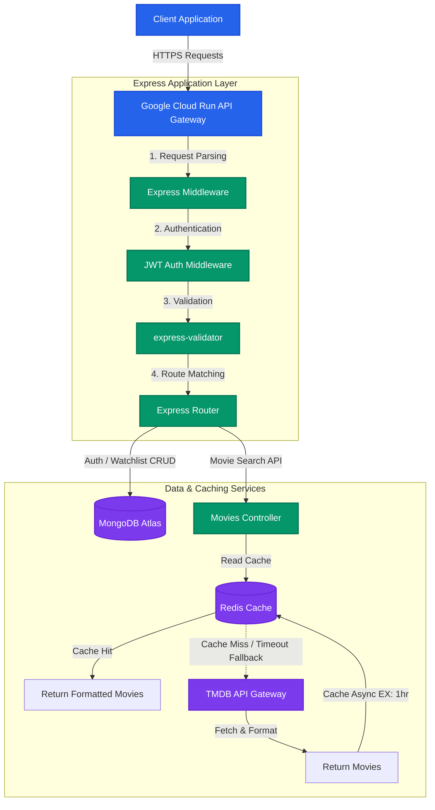
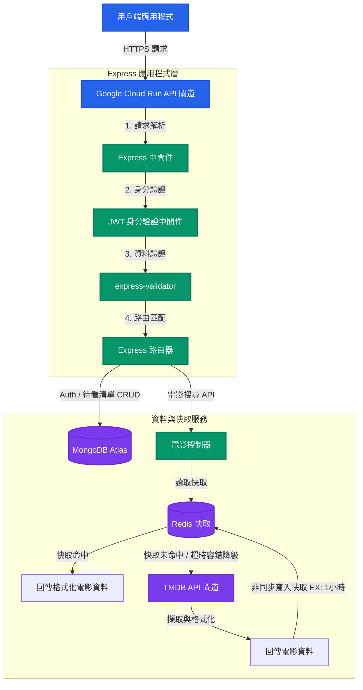

# FilmFolio Backend API

Language Select / 語言選擇：
* [English](#english)
* [繁體中文 (Taiwan)](#繁體中文-taiwan)

---

# English

FilmFolio Backend is a Node.js and Express API for movie search and watchlists. It stores data in **MongoDB Atlas**, caches search results in **Redis**, and runs in **Docker**.

The service is deployed on **Google Cloud Run** with **GitHub Actions** and **Google Cloud Build**.


---

## System Architecture



---

## Technical Highlights

### Redis cache-aside implementation
The `/api/movies/search` endpoint uses a **cache-aside** architecture with Redis:
* **Fallback:** If Redis is unavailable, queries use the TMDB API directly.
* **Expiration:** Cached search queries use a one-hour TTL (`EX 3600`).

### Authorization and data integrity
* **State-Free JWT Authentication:** Route protection is handled by a custom HTTP header parser middleware verifying signatures with custom JSON Web Tokens (`Authorization: Bearer <token>`).
* **Atomic MongoDB Updates:** To prevent race conditions during concurrent requests (e.g., adding the same movie to a watchlist twice), the backend uses MongoDB atomic updates like `$push` coupled with unique matching predicates (`$ne`), and `$pull` for instant updates.
* **Input validation:** `express-validator` checks signup and login payloads before they reach the controllers.

### 🐳 Modern DevOps & Containerization
* **Multi-Stage Container Architecture:** The `Dockerfile` uses a lightweight `node:18-alpine` base image to maintain a minimal surface area and speed up deployment runtimes.
* **Optimized Production Installation:** Runs `npm ci --omit=dev` to ensure only runtime dependencies are packaged, drastically reducing container size.
* **Continuous Delivery on Google Cloud Platform:** GitHub Actions automatically builds the Docker image on push to `main` via Google Cloud Build and promotes the deployment to **Google Cloud Run** (`asia-east1`) for serverless scaling.

---

## Tech Stack

| Technology | Purpose | Key Details |
| :--- | :--- | :--- |
| **Node.js / Express** | Application Runtime | Express v5, CommonJS |
| **MongoDB / Mongoose** | Persistent Storage | Document-based, Schema Validation, Atomic Updates |
| **Redis / ioredis** | High-Speed Cache | Key-Value Store, 1-Hour TTL Caching, Resilient Fallback |
| **JSON Web Tokens (JWT)** | Authorization | Stateless Session Signing |
| **BcryptJS** | Cryptographic Hashing | 10-Rounds Password Hashing |
| **Docker** | Containerization | Alpine Linux Base, Production Mode Setup |
| **GitHub Actions** | CI/CD | Google Cloud Platform Integration, Automated Builds |
| **Google Cloud Run** | Serverless Hosting | Region: `asia-east1`, Serverless Auto-scaling |

---

## API Reference

All protected endpoints require an `Authorization` header containing a valid JWT token:
```http
Authorization: Bearer <JWT_TOKEN>
```

### Authentication Routes

#### Register User
* **URL:** `/api/auth/register`
* **Method:** `POST`
* **Access:** Public
* **Request Body:**
  ```json
  {
    "email": "user@example.com",
    "password": "securepassword123"
  }
  ```
* **Success Response:** `201 Created`
  ```json
  {
    "msg": "User registered successfully",
    "userId": "603d659e5f5f3e2b20757a3e"
  }
  ```

#### Login User
* **URL:** `/api/auth/login`
* **Method:** `POST`
* **Access:** Public
* **Request Body:**
  ```json
  {
    "email": "user@example.com",
    "password": "securepassword123"
  }
  ```
* **Success Response:** `200 OK`
  ```json
  {
    "token": "eyJhbGciOiJIUzI1NiIsInR5cCI6IkpXVCJ9..."
  }
  ```

---

### Movie Routes

#### Search Movies
* **URL:** `/api/movies/search`
* **Method:** `GET`
* **Access:** Private
* **Query Parameters:** `query` (string, required)
* **Success Response:** `200 OK` (Utilizes Redis Cache if available)
  ```json
  [
    {
      "id": 550,
      "title": "Fight Club",
      "posterPath": "/pB8BM7rnGgK217N2vXZSgZsS8JS.jpg",
      "releaseDate": "1999-10-15"
    }
  ]
  ```

---

### Watchlist Routes

#### Create Watchlist
* **URL:** `/api/watchlists`
* **Method:** `POST`
* **Access:** Private
* **Request Body:**
  ```json
  {
    "name": "Sci-Fi Favorites",
    "description": "My top science fiction picks."
  }
  ```
* **Success Response:** `200 OK`

#### Get All Watchlists
* **URL:** `/api/watchlists`
* **Method:** `GET`
* **Access:** Private
* **Success Response:** `200 OK` (Sorted by creation date ascending)

#### Get Single Watchlist
* **URL:** `/api/watchlists/:id`
* **Method:** `GET`
* **Access:** Private
* **Success Response:** `200 OK`

#### Update Watchlist
* **URL:** `/api/watchlists/:id`
* **Method:** `PUT`
* **Access:** Private
* **Request Body:**
  ```json
  {
    "name": "Updated Watchlist Name",
    "description": "New description details."
  }
  ```
* **Success Response:** `200 OK`

#### Delete Watchlist
* **URL:** `/api/watchlists/:id`
* **Method:** `DELETE`
* **Access:** Private
* **Success Response:** `200 OK`
  ```json
  { "msg": "Watchlist removed" }
  ```

#### Add Movie to Watchlist
* **URL:** `/api/watchlists/:id/movies`
* **Method:** `POST`
* **Access:** Private (Atomic, Max 500 movies/list)
* **Request Body:**
  ```json
  {
    "movieId": 550,
    "movieTitle": "Fight Club",
    "posterPath": "/pB8BM7rnGgK217N2vXZSgZsS8JS.jpg"
  }
  ```
* **Success Response:** `200 OK` (Returns the updated movies array)

#### Remove Movie from Watchlist
* **URL:** `/api/watchlists/:watchlistId/movies/:movieId`
* **Method:** `DELETE`
* **Access:** Private (Atomic)
* **Success Response:** `200 OK`
  ```json
  { "msg": "Movie removed" }
  ```

---

## Local Setup & Development

To run the backend locally, follow these steps:

### Prerequisites
* **Node.js** (v18 or higher recommended)
* **MongoDB** (Local instance or MongoDB Atlas Connection string)
* **Redis** (Local instance running on port 6379, optional)

### Step 1: Clone & Install Dependencies
```bash
git clone <your-repository-url>
cd backend
npm install
```

### Step 2: Configure Environment Variables
Create a `.env` file in the root of the `backend` directory:
```env
PORT=3001
MONGO_URI=your_mongodb_connection_string
JWT_SECRET=your_jwt_signing_secret_key
TMDB_API_KEY=your_tmdb_developer_api_key
REDIS_URL=redis://localhost:6379
```

### Step 3: Run the Application
For local development with auto-reloads (via `nodemon`):
```bash
npm run dev
```
For production run:
```bash
npm start
```

---

## Docker Execution

To containerize the application locally:

### 1. Build the Docker Image
```bash
docker build -t filmfolio-backend .
```

### 2. Run the Container
```bash
docker run -p 3001:8080 --env-file .env filmfolio-backend
```

---

## Deployment & CI/CD Pipeline

The project uses GitHub Actions to automate GCP deployments. 

### Trigger Workflow
1. Commit changes to the `main` branch.
2. The pipeline compiles, packages, and pushes the build automatically.

### Secrets Configuration
To enable the pipeline in a personal fork, configure the following secrets in GitHub Repository Settings (`Settings > Secrets and variables > Actions`):

* `GCP_PROJECT_ID`: Your GCP Project Identifier.
* `GCP_SA_KEY`: The JSON Key of a Service Account with **Cloud Build Editor**, **Cloud Run Developer**, and **Storage Admin** roles.
* `MONGO_URI`: Production MongoDB Connection string.
* `REDIS_URL`: Production Redis url (e.g. Memorystore or Upstash).
* `JWT_SECRET`: Crypto signature key for production tokens.
* `TMDB_API_KEY`: TMDB developer credentials.

---
---

# 繁體中文 (Taiwan)

FilmFolio 是一個基於 **Node.js** 和 **Express** 構建的安全、高效能且容器化的電影目錄與待看清單管理後端 API。它利用 **MongoDB Atlas** 進行文件導向的資料持久化儲存，使用 **Redis** 進行高效能的搜尋快取並具備高可用性容錯機制，並使用 **Docker** 進行標準化本地開發與雲端部署。

本應用程式透過 **GitHub Actions** 與 **Google Cloud Build** 驅動的自動化持續部署（CI/CD）管線，部署於 **Google Cloud Run**。

本專案庫針對可擴展性、強健性及程式碼品質進行了優化，非常適合作為研究所層級系統與軟體工程的指標性參考專案。

---

## 系統架構



---

## 技術亮點

### 🚀 強健的快取旁路實作 (Redis Cache-Aside)
為最小化延遲並避免超出第三方 API 呼叫限制，`/api/movies/search` 端點採用了 **快取旁路 (Cache-Aside)** 架構：
* **高可用容錯機制：** 後端針對 `ioredis` 實作了非阻塞的 try-catch 連線封裝。若 Redis 實例發生故障或網路延遲，查詢將自動降級（Fallback）直接請求 TMDB API，確保服務 100% 正常運行。
* **自動過期機制：** 快取搜尋結果設定了 1 小時的明確存活時間（TTL, `EX 3600`），在減輕 TMDB API 流量負擔的同時確保資料新鮮度。

### 🛡️ 安全的身分驗證與資料完整性
* **無狀態 JWT 身分驗證：** 路由保護由自訂的 HTTP 標頭解析中間件（Middleware）負責，用於驗證自訂 JSON Web Token（`Authorization: Bearer <token>`）的簽章。
* **不可分割的 MongoDB 原子更新：** 為了防止並行請求引起的競爭條件（Race Conditions，例如同時發送請求將同一部電影重複加入待看清單），後端使用 MongoDB 原子更新操作（如 `$push` 配合 `$ne` 條件判斷，以及 `$pull` 進行即時刪除）。
* **嚴格的輸入驗證與清理：** 使用 `express-validator` 對註冊、登入與待看清單等路由進行嚴格的資料格式（Schema）驗證，在請求進入控制器之前，即時攔截並阻止潛在的 SQL/NoSQL 注入攻擊與格式錯誤的輸入。

### 🐳 現代化 DevOps 與容器化
* **多階段容器架構：** `Dockerfile` 基於輕量級的 `node:18-alpine` 基礎映像檔建置，以最小化容器體積並加速雲端部署速度。
* **生產環境依賴優化：** 執行 `npm ci --omit=dev` 確保僅封裝執行時期（Runtime）所需的依賴套件，大幅降低容器大小。
* **Google Cloud Platform 自動化部署：** GitHub Actions 在程式碼推送至 `main` 分支時，會自動觸發 Google Cloud Build 進行映像檔建置，並將其部署至 **Google Cloud Run**（`asia-east1` 區域）實現無伺服器（Serverless）自動彈性擴展。

---

## 技術棧 (Tech Stack)

| 技術組件 | 用途 | 關鍵細節 |
| :--- | :--- | :--- |
| **Node.js / Express** | 應用程式執行環境 | Express v5, CommonJS |
| **MongoDB / Mongoose** | 持久化資料儲存 | 文件導向、Schema 驗證、原子性更新 |
| **Redis / ioredis** | 高速快取層 | 鍵值對儲存、1小時 TTL 快取、容錯降級機制 |
| **JSON Web Tokens (JWT)** | 使用者授權 | 無狀態階段簽章 |
| **BcryptJS** | 加密雜湊驗證 | 10 輪密碼雜湊加密 |
| **Docker** | 服務容器化 | Alpine Linux 基礎、生產環境模式設定 |
| **GitHub Actions** | CI/CD 自動化 | 與 Google Cloud Platform 整合，自動化建置 |
| **Google Cloud Run** | 無伺服器代管 | `asia-east1` 區域，無伺服器自動彈性擴展 |

---

## API 接口說明 (API Reference)

所有受保護的 API 端點皆必須在 HTTP Header 中帶入有效的 JWT 憑證：
```http
Authorization: Bearer <JWT_TOKEN>
```

### 使用者驗證路由 (Authentication)

#### 註冊使用者
* **URL:** `/api/auth/register`
* **Method:** `POST`
* **Access:** 公開 (Public)
* **Request Body:**
  ```json
  {
    "email": "user@example.com",
    "password": "securepassword123"
  }
  ```
* **成功回應:** `201 Created`
  ```json
  {
    "msg": "User registered successfully",
    "userId": "603d659e5f5f3e2b20757a3e"
  }
  ```

#### 登入帳號
* **URL:** `/api/auth/login`
* **Method:** `POST`
* **Access:** 公開 (Public)
* **Request Body:**
  ```json
  {
    "email": "user@example.com",
    "password": "securepassword123"
  }
  ```
* **成功回應:** `200 OK`
  ```json
  {
    "token": "eyJhbGciOiJIUzI1NiIsInR5cCI6IkpXVCJ9..."
  }
  ```

---

### 電影路由 (Movie Routes)

#### 搜尋電影
* **URL:** `/api/movies/search`
* **Method:** `GET`
* **Access:** 受保護 (Private)
* **Query Parameters:** `query` (字串, 必填)
* **成功回應:** `200 OK` (若 Redis 可用，將優先使用快取資料)
  ```json
  [
    {
      "id": 550,
      "title": "Fight Club",
      "posterPath": "/pB8BM7rnGgK217N2vXZSgZsS8JS.jpg",
      "releaseDate": "1999-10-15"
    }
  ]
  ```

---

### 待看清單路由 (Watchlist Routes)

#### 建立待看清單
* **URL:** `/api/watchlists`
* **Method:** `POST`
* **Access:** 受保護 (Private)
* **Request Body:**
  ```json
  {
    "name": "科幻最愛",
    "description": "我最推薦的科幻電影清單。"
  }
  ```
* **成功回應:** `200 OK`

#### 取得所有待看清單
* **URL:** `/api/watchlists`
* **Method:** `GET`
* **Access:** 受保護 (Private)
* **成功回應:** `200 OK` (依建立時間由舊到新排序)

#### 取得單一待看清單詳細資訊
* **URL:** `/api/watchlists/:id`
* **Method:** `GET`
* **Access:** 受保護 (Private)
* **成功回應:** `200 OK`

#### 更新待看清單
* **URL:** `/api/watchlists/:id`
* **Method:** `PUT`
* **Access:** 受保護 (Private)
* **Request Body:**
  ```json
  {
    "name": "更新後的清單名稱",
    "description": "新的描述細節。"
  }
  ```
* **成功回應:** `200 OK`

#### 刪除待看清單
* **URL:** `/api/watchlists/:id`
* **Method:** `DELETE`
* **Access:** 受保護 (Private)
* **成功回應:** `200 OK`
  ```json
  { "msg": "Watchlist removed" }
  ```

#### 將電影加入待看清單
* **URL:** `/api/watchlists/:id/movies`
* **Method:** `POST`
* **Access:** 受保護 (Private, 原子操作, 單一清單上限 500 部電影)
* **Request Body:**
  ```json
  {
    "movieId": 550,
    "movieTitle": "Fight Club",
    "posterPath": "/pB8BM7rnGgK217N2vXZSgZsS8JS.jpg"
  }
  ```
* **成功回應:** `200 OK` (回傳更新後的電影陣列)

#### 從待看清單移除電影
* **URL:** `/api/watchlists/:watchlistId/movies/:movieId`
* **Method:** `DELETE`
* **Access:** 受保護 (Private, 原子操作)
* **成功回應:** `200 OK`
  ```json
  { "msg": "Movie removed" }
  ```

---

## 本地安裝與開發 (Local Setup)

要在本地運行此後端服務，請按照以下步驟操作：

### 先決條件
* **Node.js** (建議 v18 或更高版本)
* **MongoDB** (本地 MongoDB 服務或 MongoDB Atlas 連線字串)
* **Redis** (運行於 Port 6379 的本地 Redis，選填)

### 步驟 1: 複製儲存庫並安裝相依套件
```bash
git clone <your-repository-url>
cd backend
npm install
```

### 步驟 2: 設定環境變數
在 `backend` 目錄的根目錄建立一個 `.env` 檔案：
```env
PORT=3001
MONGO_URI=您的_mongodb_連線字串
JWT_SECRET=您的_jwt_簽署金鑰
TMDB_API_KEY=您的_tmdb_開發者api金鑰
REDIS_URL=redis://localhost:6379
```

### 步驟 3: 啟動應用程式
本地開發（支援 Nodemon 自動重載）：
```bash
npm run dev
```
以生產環境模式運行：
```bash
npm start
```

---

## Docker 執行

在本地將應用服務容器化：

### 1. 建置 Docker 映像檔
```bash
docker build -t filmfolio-backend .
```

### 2. 啟動 Container
```bash
docker run -p 3001:8080 --env-file .env filmfolio-backend
```

---

## 部署與 CI/CD 管線

本專案使用 GitHub Actions 來自動化 GCP 部署。

### 觸發部署流程
1. 將變更提交並推送（Push）至 `main` 分支。
2. 管線會自動開始編譯、封裝，並推送建置結果。

### Secrets 機密環境變數設定
若要在您個人的 Fork 中啟用此 Deployment Pipeline，請至 GitHub 儲存庫設定 (`Settings > Secrets and variables > Actions`) 設定以下 Secret 變數：

* `GCP_PROJECT_ID`: 您的 GCP 專案 ID。
* `GCP_SA_KEY`: Service Account 的 JSON 金鑰（需具備 **Cloud Build Editor**、**Cloud Run Developer** 及 **Storage Admin** 權限）。
* `MONGO_URI`: 生產環境的 MongoDB Atlas 連線字串。
* `REDIS_URL`: 生產環境的 Redis 連線網址 (例如 GCP Memorystore 或 Upstash)。
* `JWT_SECRET`: 生產環境 JWT 簽章所用的加秘密鑰。
* `TMDB_API_KEY`: TMDB 開發者 API 金鑰。
